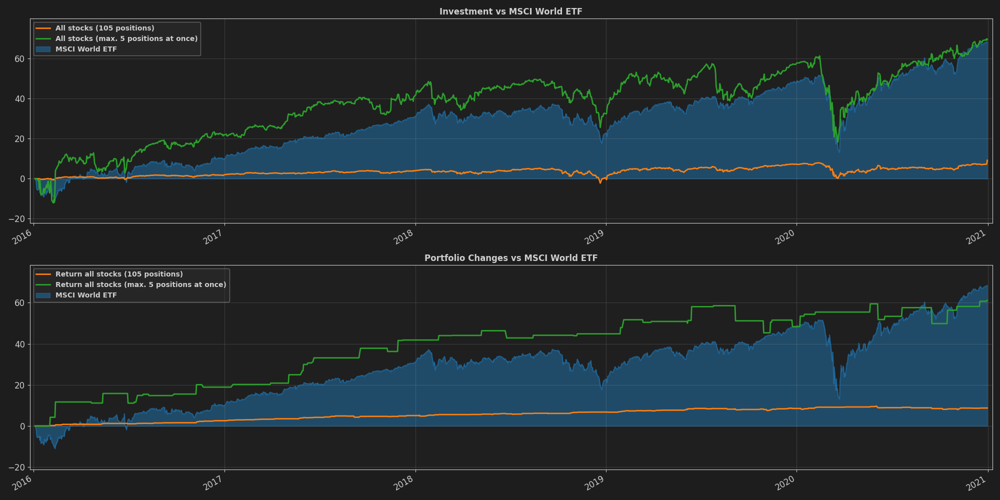

# pomalu, ale jistĕ ...

... I want to play with an AI that uses the PyTorch framework to
chew through some time series like stock prices.


* taken from pomalu-ale-jiste v0.0.5 pre-release

## my way I will go ...

1. I want to create a simple auto-encoder that remembers possible
patterns in stock market data. Training this network should be solvable
using unsupervised learning.
1. Then I want to train a network to classify comparison results from input
and output of the auto-encoder using supervised learning.

My personal goal is to build an overall network that I can throw some
historical end of day data into and observe how it would act alongside
the training data on other unknown test data.

The results will DEFINITELY be BAD, but perhaps the results will surprise.
I don't know!

## the data ...

Getting good stock market data can be a real challenge.
I will use the Tiingo data service to retrieve historical end of day (EOD)
data for training and testing purposes.
Tiingo offers a free of charge subscription that is limited by, for example,
volume and number of requests. It further supports REST and Websocket APIs
to get the data as I need it. Long story short, Tiingo just seems to be
quite perfect for this purpose.

You can find more details here: [https://api.tiingo.com](https://api.tiingo.com)

## the visualization of training ...

The project provides a dashboard to visualize the training process using containerized services.


### Prerequisits

- Install docker and docker-compose, further details in ["Get Docker"](https://docs.docker.com/get-docker/)

### Run
1. Execute ```docker-compose up``` inside of ```pomalu-ale-jiste/docker``` folder 
in your favorite command shell
1. Open [http://localhost:3000](http://localhost:3000) in
your favorite browser
1. Log in with the user ``admin`` and the password ``admin``, you will be asked for a new password by default.
1. Navigate to ```pomalu, ale jistĕ ...``` dashboard in folder ```Services```

## WARNING

Some events and data may already be priced into the historical data and form
a possible indicator to predict something in the future.

The TRUE story is:
The EXCHANGE MARKET is VERY COMPLEX AND VOLATILE!
There are a multitude of factors, such as events, data, crises, and even
the current weather conditions at that moment can affect the market,
resulting in a HUGE LOSS or minimal gain in the shares.
One thing is for sure, the project will NEVER BE the magic money maker
to beat the stock market and it is NO GUARANTEE FOR THE INVESTMENT
DECISIONS YOU MAKE YOURSELF! YOU ARE RESPONSIBLE FOR YOUR
OWN INVESTMENTS BASED ON YOUR OWN DECISIONS, NOT ME OR
THE SOFTWARE!

The project and the resulting agent is just a simple TRIAL AND ERROR,
true to the motto "I'll just try it out!" and WILL DEFINITELY NOT BEAT THE
MARKET. It's just to play with some historical time series data....

## DISCLAIMER
THE SOFTWARE IS PROVIDED "AS IS", WITHOUT WARRANTY OF ANY KIND,
EXPRESS OR IMPLIED, INCLUDING BUT NOT LIMITED TO THE WARRANTIES
OF MERCHANTABILITY, FITNESS FOR A PARTICULAR PURPOSE AND
NONINFRINGEMENT. IN NO EVENT SHALL THE AUTHORS OR COPYRIGHT
HOLDERS BE LIABLE FOR ANY CLAIM, DAMAGES OR OTHER LIABILITY,
WHETHER IN AN ACTION OF CONTRACT, TORT OR OTHERWISE, ARISING
FROM, OUT OF OR IN CONNECTION WITH THE SOFTWARE OR THE USE OR
OTHER DEALINGS IN THE SOFTWARE.
